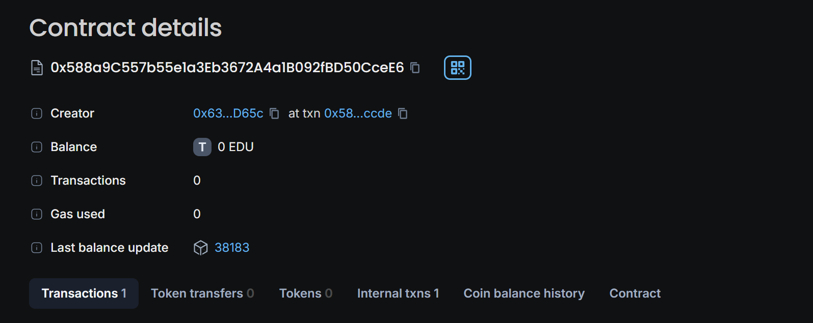

# Educational Resource Smart Contract

This Solidity smart contract allows users to purchase access to an educational resource and resell that access to others. The contract is designed to facilitate the buying, accessing, and reselling of digital educational content on the Ethereum blockchain.

## Features

- **Purchase Access**: Users can purchase access to an educational resource by paying an access fee.
- **Resale of Access**: Users who have access to the resource can list their access for resale at a price they choose.
- **Direct Payment**: When reselling, the seller receives the full amount of the resale payment.

## Contract Structure

### State Variables

- `owner`: The address of the contract owner (typically the content creator or publisher).
- `accessFee`: The fee required to purchase initial access to the resource.
- `resourceHash`: A hash representing the digital content (e.g., an IPFS hash).
- `hasAccess`: A mapping to track which addresses have access to the resource.
- `resalePrice`: A mapping to track the resale price set by users who wish to resell their access.

### Events

- `AccessGranted(address indexed user)`: Emitted when a user purchases access to the resource.
- `ResourceAccessed(address indexed user)`: Emitted when a user accesses the resource.
- `ResaleListed(address indexed user, uint256 price)`: Emitted when a user lists their access for resale.
- `ResaleCompleted(address indexed seller, address indexed buyer, uint256 price)`: Emitted when a resale transaction is completed.

### Functions

#### `constructor(uint256 _accessFee, string memory _resourceHash)`

Initializes the contract with an access fee and the resource hash. Sets the contract deployer as the owner.

#### `grantAccess() public payable`

Allows a user to purchase access to the resource by paying the required access fee. The user is then granted access.

#### `accessResource() public view onlyIfHasAccess returns (string memory)`

Allows a user who has access to retrieve the resource hash, which can be used to obtain the resource off-chain (e.g., from IPFS).

#### `listForResale(uint256 price) public onlyIfHasAccess`

Allows a user who has access to list their access for resale at a specified price.

#### `purchaseResale(address seller) public payable`

Allows a user to purchase access from another user who has listed their access for resale. The payment is transferred to the seller, and the buyer gains access to the resource.

#### `updateAccessFee(uint256 newFee) public onlyOwner`

Allows the owner to update the access fee.

#### `updateResourceHash(string memory newResourceHash) public onlyOwner`

Allows the owner to update the resource hash.

## How to Use

1. **Grant Access**: Users can call the `grantAccess` function to purchase access by sending the required Ether to the contract.

2. **Access Resource**: Once access is granted, users can call the `accessResource` function to retrieve the resource hash.

3. **Resale**: Users who have access can list their access for resale by calling the `listForResale` function with their desired price.

4. **Purchase Resale**: Another user can purchase access from the reseller by calling the `purchaseResale` function and sending the appropriate amount of Ether.

## License

This project is licensed under the MIT License. See the `LICENSE` file for more details.

## Deployment

Chain: EduChain
Chain Id:0x5B38Da6a701c568545dCfcB03FcB875f56beddC4

